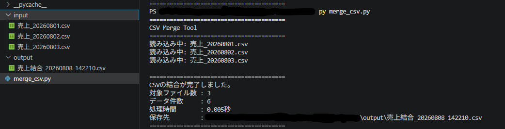

# CSV Merge Tool

複数のCSVファイルを安全に1つへ結合するPythonツールです。

同じフォルダ内のCSVを自動で読み込み、ヘッダーを重複させずに結合します。
列構成が異なるCSVを検知した場合は処理を中止し、不完全な出力ファイルを残さないようにしています。

---

## 動作画面



---

## 主な機能

- 複数CSVの一括結合
- ヘッダー重複の防止
- 列構成の自動チェック
- 空CSVのスキップ
- エラー発生時の安全停止
- 出力ファイルの自動生成
- 日時付きファイル名
- 処理件数の表示
- 処理時間の計測
- UTF-8 BOM付きCSV出力

---

## 使用技術

- Python
- csv
- pathlib
- datetime
- time

外部ライブラリは使用していません。

---

## 実行時のフォルダ構成

```text
CSV_Merge_Tool
├── input
│   ├── 売上_20260801.csv
│   ├── 売上_20260802.csv
│   └── 売上_20260803.csv
├── output
└── merge_csv.py
